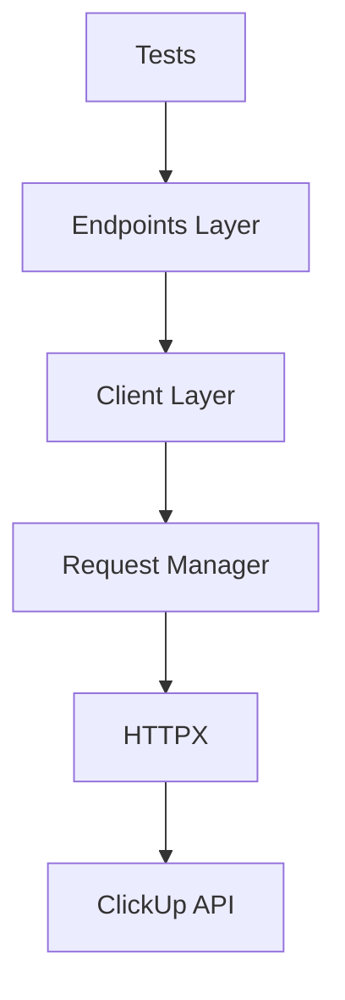

# ClickUp API Testing Framework

---

# Summary

This project provides a API automation testing framework for ClickUp built with Python.

The framework focuses on:

* Scalability
* Maintainability
* Reusability
* Reporting
* Parallel execution
* Continuous Integration
* Schema validation
* Structured logging

The solution follows a layered architecture that separates business logic, API communication, validations, and test implementation.

---

# Technology Stack

| Category             | Tool                   | Purpose                          |
| -------------------- | ---------------------- | -------------------------------- |
| Language             | Python 3.12+           | Main programming language        |
| Test Runner          | pytest                 | Test execution and orchestration |
| HTTP Client          | httpx                  | API communication                |
| Schema Validation    | Pydantic v2            | Data validation and modeling     |
| Logging              | structlog              | Structured logging               |
| Configuration        | pydantic-settings      | Environment management           |
| Linting & Formatting | Ruff                   | Code quality                     |
| Coverage             | pytest-cov             | Coverage reporting               |
| Soft Assertions      | pytest-check           | Multiple validations per test    |
| Reporting            | pytest-html, JUnit XML | Test reports                     |
| Parallel Execution   | pytest-xdist           | Distributed execution            |
| CI/CD                | GitHub Actions         | Automation pipelines             |

---

# Architecture



---

# Design Principles

| Principle              | Description                               |
| ---------------------- | ----------------------------------------- |
| Separation of Concerns | Each layer has a single responsibility    |
| Reusability            | Shared components across tests            |
| Scalability            | Easy onboarding of new resources          |
| Maintainability        | Centralized configuration and validations |
| Observability          | Structured logging and reporting          |
| Performance            | Parallel execution support                |

---

# Project Structure

```text
clickup-api-framework/         # Root folder of the automation project.
├── .github/                   # GitHub-specific configurations.
│   └── workflows/             # CI/CD pipeline automation scripts (GitHub Actions).
├── config/                    # Global settings and configuration management.
│   └── environments/          # Environment-specific variables (like dev or CI).
├── core/                      # The main engine, base classes, and core framework logic.
├── clients/                   # API client wrappers and connection setup.
├── domains/                   # ClickUp API business resources and endpoint logic.
│   ├── teams/                 # Endpoints, schemas, and payloads for Teams.
│   ├── spaces/                # Endpoints, schemas, and payloads for Spaces.
│   ├── folders/               # Endpoints, schemas, and payloads for Folders.
│   ├── lists/                 # Endpoints, schemas, and payloads for Lists.
│   └── tasks/                 # Endpoints, schemas, and payloads for Tasks.
├── helpers/                   # Reusable utility functions (data generators, formatters).
├── tests/                     # The actual automated test suites.
│   ├── acceptance/            # End-to-end (E2E) complete user workflows.
│   ├── functional/            # Isolated CRUD operations and individual feature tests.
│   ├── negative/              # Error handling, security, and invalid input tests.
│   ├── smoke/                 # Quick health checks for critical API endpoints.
│   ├── regression/            # Tests to ensure existing features are not broken.
│   └── unit/                  # Tests for internal framework functions and methods.
├── reports/                   # Generated test results, logs, and coverage files.
└── docs/                      # Project documentation, guides, and manuals.
```

---

# ClickUp Resources

## Priority 1 Resources

| Resource | Description       |
| -------- | ----------------- |
| Teams    | Team management   |
| Spaces   | Workspace spaces  |
| Folders  | Folder management |
| Lists    | List management   |
| Tasks    | Task management   |

---

# CRUD Coverage Strategy

| Resource | Create | Read | Update | Delete |
| -------- | ------ | ---- | ------ | ------ |
|          | ✅     |      |       |         |
|          |        |     |       |      |
|          |        |     |       |         |
|          |        |     |       |   |
|          |        |     |       |       |

---

# Mandatory Assertions

Every automated test must validate the following:

| Validation        | Example                                   |
| ----------------- | ----------------------------------------- |
| Status Code       |  |
| Response Body     |          |
| Schema Validation |         |
| Data Integrity    |        |

---

# Request Manager

The framework uses a Singleton-based Request Manager.

## Responsibilities

| Responsibility     | Description                       |
| ------------------ | --------------------------------- |
| Connection Reuse   | Reuse HTTP connections            |
| Authentication     | Manage authorization headers      |
| Timeouts           | Centralized timeout configuration |
| Session Management | Single HTTPX instance             |
| Global Headers     | Shared request headers            |

### Rule

> No test should call HTTPX directly.
> All requests must pass through the Request Manager.

---

# Logging Strategy

Using **structlog**.

## Logged Events

| Event             |
| ----------------- |
| Test Started      |
| Request Sent      |
| Payload Sent      |
| Response Received |
| Validation Error  |
| Execution Time    |
| Final Result      |

---

# Fixtures

Global fixtures defined in ``.

| Fixture              | Purpose            |
| -------------------- | ------------------ |
|  |  |
|       |  |
|                |    |
|             |   |
|     |    |

---

# Test Lifecycle Hooks

## Before Session

* Initialize Logger
* Initialize Request Manager
* Load Configuration

## After Session

* Close HTTP Client
* Generate Reports

## Before Test

* Prepare Test Data

## After Test

* Cleanup Created Resources

---

# Test Categories

| Category   | Purpose                        |
| ---------- | ------------------------------ |
| Smoke      | Verify service availability    |
| Functional | Validate expected behavior     |
| Negative   | Validate error handling        |
| Acceptance | Validate end-to-end workflows  |
| Regression | Protect critical functionality |

---

# Test Markers

```python
@pytest.mark.smoke
@pytest.mark.functional
@pytest.mark.negative
@pytest.mark.acceptance
@pytest.mark.regression
```

---

# Coverage Strategy

## Unit Test Coverage

| Component        |
| ---------------- |
| Request Manager  |
| Logger           |
| Schema Validator |
| Helpers          |
| Configuration    |


---

# Soft Assertions

Using **pytest-check**.

## Benefits

| Benefit                               |
| ------------------------------------- |
| Multiple validations in one execution |
| Better error visibility               |
| Richer reporting                      |
| Better debugging experience           |

---


---

# Naming Conventions

## Test Files

```text
test_create_space.py
test_update_task.py
test_delete_folder.py
```

## Schema Files

```text
space_schema.py
task_schema.py
```

## Endpoint Files

```text
space_endpoints.py
task_endpoints.py
```

## Payload Files

```text
space_payloads.py
task_payloads.py
```

---